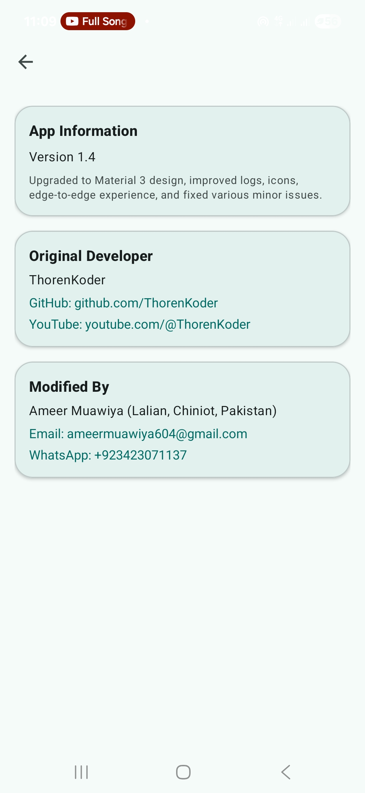

# LibVault (formerly Dependency Haven)

> [!NOTE]  
> **This project was originally developed as [Dependency Haven](https://github.com/euptron/dependency-haven)**  
> It has now been upgraded, modernized, and renamed to **LibVault** by **Ameer Muawiya**.

LibVault is a modern, Material 3–based dependency management tool for Android and Java projects. It helps developers manage, resolve, and organize dependencies in a clean and visual way.

---

## ✨ What's New (2025 Update by Ameer Muawiya)

- App renamed to **LibVault**  
- Full **Material 3** redesign with updated colors and theming  
- **Edge-to-Edge layout fix** for Android 11–15  
- Replaced **Navigation Rail** with **Bottom Navigation**  
- Added **Downloads Management Screen** for tracking and controlling dependency downloads  
- Added a **shared Toolbar** across all screens  
- Improved **Dependency Manager UI** with new actions (e.g., Stop button)  
- Refactored **Settings screen** and default folder logic  
- Added a new **About screen** with proper developer credits  
  - *Developed by EUP*  
  - *Modified by Ameer Muawiya*

---

## 🖼️ Screenshots

| Main Dashboard | Downloads | Settings | About |
|----------------|------------|-----------|--------|
|  |  |  |  |

---

## ⚙️ Features

- [x] Resolve direct dependencies  
- [x] Resolve transitive dependencies  
- [x] Cache resolved dependency POM and library  
- [x] Read repositories from JSON  
- [x] Handle parent POM  
- [x] Handle POM properties  
- [x] Skip unnecessary resolution  
- [x] Modern Material 3 interface  
- [x] Edge-to-edge adaptive layout  
- [x] Downloads management with progress  
- [ ] Remote authentication  
- [ ] CLI mode  
- [ ] Auto update cached library and POM  

---

## 🚀 Installation

1. Add the following in your root `build.gradle` at the end of repositories:

```gradle
dependencyResolutionManagement {
    repositoriesMode.set(RepositoriesMode.FAIL_ON_PROJECT_REPOS)
    repositories {
        mavenCentral()
        maven { url 'https://jitpack.io' }
    }
}
```

2. Add this dependency in your module’s `build.gradle`:

```gradle
dependencies {
    implementation 'com.github.etidoUP:dependency-haven:0.1.0-alpha'
}
```

---

## 📚 Documentation

Visit the [Wiki](https://github.com/euptron/dependency-haven/wiki) for setup and usage details.

---

## 📜 License

MIT License  
Copyright (c) 2023 EUP  
Modified version by Ameer Muawiya (2025)

---

## 🙏 Acknowledgements

- Original project by EUP  
- Special thanks to Tyron for the POM parsing class  
- Modernized, refactored, and rebranded by Ameer Muawiya
